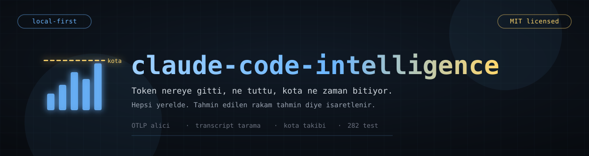
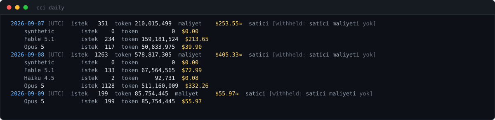
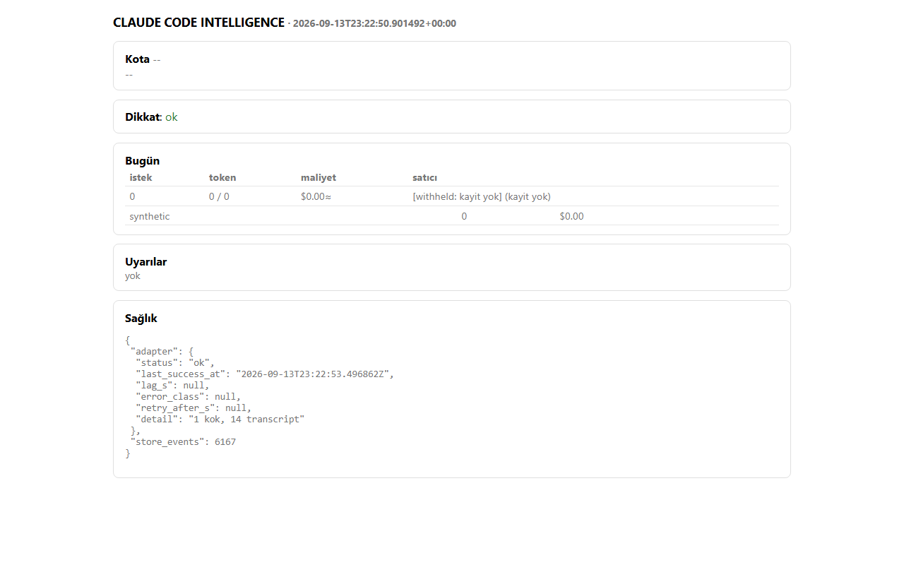

# claude-code-intelligence

<details>
<summary><b>In English</b></summary>

<br>

**Where your Claude Code tokens went, what they cost, and when the quota resets.** It is a local-first layer that observes, normalises, forecasts and alerts on AI coding-agent usage. Claude Code comes first; the architecture takes other providers as adapters. The rest of this README is in Turkish.

- **No content, by construction.** Prompts, responses, tool arguments and file contents are not defined in any type, so a privacy review is a `grep`.
- **Local-first.** The network inventory has two targets: the quota endpoint and an optional price refresh. The OTLP receiver listens on `127.0.0.1`. Nothing is exported without explicit consent.
- **An evidence class on every number:** observed, derived, vendor-estimated, estimated, predicted or inferred. A cost derived from list prices is marked `≈`, and where a vendor does not report its own cost the figure is `[withheld]` rather than invented.
- **Conservation law.** Every report satisfies `total = Σ parts`; `--strict` exits 3 when one does not.

```bash
uv sync && uv run pytest      # 282 tests
uv run cci scan               # read Claude Code transcripts incrementally
uv run cci daily              # requests, tokens and estimated cost per day, by model
uv run cci quota --forecast   # when the limit is hit at this pace (needs 5+ polled cycles)
uv run cci snapshot && uv run cci serve   # local dashboard
```

</details>

AI coding agent kullanımını (önce Claude Code, mimari olarak diğer
sağlayıcılar) **gözlemleyen, normalize eden, analiz eden, ölçen, tahmin
eden, anomali tespit eden, uyaran ve "şu anda ne yapmalıyım?" sorusuna
veriye dayalı cevap veren** yerel-öncelikli bir istihbarat/kontrol katmanı.

Bu bir usage monitor, token sayacı, kota görüntüleyici, pano, CLI aracı
veya taskbar widget'ı **değildir** — bunların birleşiminden büyük bir sistem
hedefleniyor.



<sub>Gerçek çıktı, elle yazılmış bir örnek değil: `python scripts/gorsel-uret.py`
bu görseli `cci daily`'yi çalıştırıp üretir. Dikkat edilecek iki işaret —
maliyetin yanındaki **≈** rakamın liste fiyatından türetilmiş bir tahmin
olduğunu söyler, **`[withheld]`** ise satıcının kendi maliyetini vermediği
yerde uydurulmadığını. Bu depoda tahmin, ölçümün yerine geçmez.</sub>

## Hızlı başlangıç

Yerel-öncelikli pano: Claude Code transcript'lerini tarar, bir anlık görüntü
üretir ve tarayıcıda gösterir.

```
uv sync
uv run cci scan
uv run cci snapshot
uv run cci serve
```



<sub>Panonun kendisi, yukarıdaki dört komut çalıştırıldıktan sonra. Gösterdiği
her sayı taranmış gerçek transcript'lerden geliyor.</sub>

## Yöntem ve durum

```
Research → Discover → Score → Deep Analyze → Extract → Synthesize
        → Design → Critique → Implement → Benchmark → Improve
   ✅        ✅        ✅         ✅           ✅          ✅
                                            → ✅ Design (Faz 7–9) → ✅ Implement (Stage 1–16)
```

**Kod durumu:** `cci/` paketi — model (Stage 1), adaptör sözleşmesi (2),
toplayıcılar: zarf + ingest kapısı, transcript izleyici, kota poller, OTLP/JSON
alıcı (3), SQLite olay deposu (4), normalizasyon + dedup/birleştirme (5), fiyat
tablosu + özetler (6), pace v1 + boru hattı + snapshot + CLI (7).

```
uv sync && uv run pytest                    # 273 test
uv run cci providers                        # ulaşılabilen adaptörler + yüklenemeyenin nedeni
uv run cci scan                             # kayıtlı her adaptörden artımlı tara
uv run cci today | daily | sessions         # özetler (--json, --strict → koruma yasası ihlalinde çıkış 3)
uv run cci session <id>                     # oturum teşhisi (döngü, araç p95, context, sağlık)
uv run cci quota [--poll|--forecast|--backtest]
uv run cci advise [--apply|--undo <id>]     # "şu anda ne yapmalıyım" + geri alınabilir eylem
uv run cci alerts [--history]               # uyarı motoru (cooldown, sessiz saat, webhook)
uv run cci doctor                           # "bu sayılara güvenebilir miyim"
uv run cci setup otlp|statusline [--write]  # settings.json'a yedekli yazım
uv run cci run [--once]                     # daemon: OTLP 4318 + API 4319 + tarama + kota + uyarı + snapshot
uv run cci serve | tui | widget | statusline
uv run cci research proxy|unit-estimator|purge
uv run python benchmarks/bench.py           # → benchmarks/RESULTS.md
```

Stage 1–16 tamamlandı. Ölçülen performans ve tutmayan iki hedefin gerekçesi:
`docs/ARCHITECTURE.md` §11. Stage 15'in kapsam dışı kalan kısmı:
`docs/IMPLEMENTATION_PLAN.md` §Stage 15 notu — dört adaptör planlanmıştı, ikisi
var (Claude Code, Codex); geri kalanı için gereken şey kod değil, doğrulanmış
fixture.

| Çıktı | Nerede |
|---|---|
| Görev tanımı (kullanıcı) | `docs/MASTER_PROMPT.md` |
| Aşamalar ve kabul ölçütleri | `docs/IMPLEMENTATION_PLAN.md` |
| Araştırma veri seti (232 repo, 13 kriter/100) | `research/catalog.jsonl`, `research/reports/catalog.md`, `research/tools/catalog.py` |
| Veri toplama yaklaşımları + resmî kaynak doğrulaması | `research/notes/01-*.md`, `02-resmi-kaynaklar.md`, `03-otel-genai-semconv.md` |
| Top 20 ve derin analizler (20 repo, kaynak kod düzeyi) | `research/reports/top20.md`, `research/notes/deep/*.md` |
| Sentez: 58 kalıp, 14 anti-kalıp, 10 açık problem, rekabet tablosu, D1–D10 | `research/reports/sentez.md` |
| Mimari | `docs/ARCHITECTURE.md` · `DATA_MODEL.md` · `EVENTS.md` · `PROVIDERS.md` · `PRIVACY.md` · `ANALYTICS.md` · `EXTENDING.md` · `RESEARCH_MODE.md` |
| Katkı kuralları | `CONTRIBUTING.md` |

## Temel ilkeler (baştan sabit; araştırmayla somutlaştı)

1. **Kanıt sınıfı her sayıda:** Observed / Derived / Vendor-estimated /
   Estimated / Predicted / Inferred. Para ve tahmin alanları `Figure`
   tipindedir; mutabakat kapısını geçmeyen sayı **basılmaz**.
2. **İçerik alanı yok.** Prompt, yanıt, araç argümanı, dosya içeriği hiçbir
   tipte tanımlı değildir; gizlilik incelemesi `grep` ile yapılabilir.
3. **Local-first.** Ağ envanteri iki hedeften ibarettir (kota ucu, isteğe
   bağlı fiyat yenileme); dışa aktarım yalnız açık rıza ile (Eco aşaması).
4. **Nazik veri toplama.** Token rotasyonu/yenileme, UA taklidi, kota harcayan
   sentetik istek yok; 429'a saygı, geri çekilme.
5. **Koruma yasası.** Her rapor `toplam = Σ parça`; `--strict` çıkış 3.
6. **Aşamalı inşa.** Core → Advanced → Intelligence → Ecosystem; "do not
   overbuild".
7. **Tekrarlanabilir analitik.** Türetimler saf fonksiyon; `cci replay`;
   sürümlü özet/estimator/fiyat.
8. **Tek gerçek kaynak.** Aynı bilgi iki yerde elle tutulmaz; kopya varsa
   testi vardır.

## Önceki çalışmayla ilişki

[`claude-quota-monitor`](https://github.com/Furkiozknn/claude-quota-monitor)
(arşivli) bu platformun prototipidir; öğrenilenler
`research/notes/00-seed-from-claude-quota-monitor.md` içinde. Platform onu
**kapsayacak**, ona bağımlı olmayacak.

## Güvenlik notu (araştırmadan)

Üçüncü taraf repo klonlarken `.claude/skills` veya `hooks` taşıyan bir depo
Claude Code oturumuna skill enjekte edebilir (bu projede yaşandı). Klonları
geçici dizinde tutun; `.claude/` içeriğini çalıştırmayın. Ayrıntı:
`docs/PRIVACY.md` §5.

---

## Kendi adaptörünü yazmak

`cci` sağlayıcıya bağlı değil: transcript okuyan her araç bir adaptörle
bağlanabiliyor, ve sözleşme `cci/adapters/base.py` içinde
(`docs/PROVIDERS.md §2`). Uzatma noktası olduğunu söyleyen bir projede o
noktanın belgesiz olması, pratikte kapalı olması demek — sözleşmeyi
uygulayacak kişi kaynağı okuyup niyeti tahmin etmek zorunda kalır.

`adapters/` altındaki **26 genel sembolün 26'sı** artık ne yaptığını ve neden
öyle olduğunu yazıyor. Belgelenen şey imza değil karar: `Capabilities`
alanlarının neden dürüstçe doldurulması gerektiği (`tokens=True` deyip token
vermeyen bir adaptör, aşağıdaki her sayıyı sessizce bozar, çünkü eksik veri ile
sıfır veri aynı görünür), `Health.status`'un neden üç değerli olduğu,
`FileCursor`'ın neden üç alanı birden tuttuğu (dosya kırpılıp yeniden
yazıldıysa aynı ofset artık başka bir satırın ortasıdır), `RawBatch`'in neden
kalıcı olmadığı, `credentials_path`'in neden var olup hiç açılmadığı.

Bir kapı bunu koruyor: `python3 arac/sozlesme-belgeli.py` — `cci/adapters/`
altındaki her genel sembolün bir docstring'i olduğunu kontrol ediyor. Deponun
geri kalanı için böyle bir zorunluluk yok; kapı bilerek yalnızca dışarıya açık
yüzeyi kapsıyor.

**Ama belgelenmiş bir uzatma noktası, ona takılamıyorsa kapalıdır.** Sözleşme
belgeliydi ve sözleşme testi vardı; kayıt defteri de vardı — ve `register()`
deponun tamamında yalnızca bir testten çağrılıyordu. Ürünün hiçbir yeri kayıt
defterini okumuyor, her çağrı yeri somut sınıfı adıyla içe aktarıyordu. Yani
`EXTENDING.md`'yi harfiyen izleyip bir adaptör yazan kişi, hiçbir zaman
çağrılmayacak bir nesne elde ediyordu.

Artık bir giriş noktası grubu var ve birinci taraf iki adaptör de aynı yoldan
geçiyor:

```toml
[project.entry-points."cci.adapters"]
my_tool = "cci_adapter_my_tool:build"
```

```
uv run cci providers            # hangi adaptör ulaşılabiliyor, ulaşamayanın nedeni ne
uv run cci providers --strict   # bir eklenti yüklenemediyse çıkış 3
```

Sözleşme testi bunu ispat edemezdi: gördüğü adaptörler aynı dosyada, aynı
elden yazılmıştır. `tests/test_adapter_plugins.py` adaptörü paket sınırının
**dışına** koyuyor — geçici dizin, kendi `.dist-info` meta verisi, yani
`pip install`in ürettiğinin aynısı — ve `cci scan`ın onun kaydını gerçekten
olay deposuna yazdığını gösteriyor. Negatif kontrol de orada: meta veri
kaldırılınca hiçbir şey bulunmuyor, yani testi geçiren şey modülün
`sys.path`te olması değil, giriş noktasının kendisi. Patlayan bir eklenti
kendini devre dışı bırakıyor, çekirdeği değil.


## Bu ekosistemden başka projeler

- **[mcp-vet](https://github.com/Furkiozknn/mcp-vet)** — bir MCP sunucusunun kaynağını kurmadan önce denetler
- **[repo-vet](https://github.com/Furkiozknn/repo-vet)** — README'nin verdiği sözleri gerçekle karşılaştırır
- **[godot-refcheck](https://github.com/Furkiozknn/godot-refcheck)** — Godot projelerindeki kırık referansları ve ölü sinyalleri bulur, onarır
- **[mcp-census](https://github.com/Furkiozknn/mcp-census)** — resmî MCP Registry'nin yeniden üretilebilir sayımı

<sub>Hepsi tek bir aranabilir sayfada: **[furkiozknn.github.io](https://furkiozknn.github.io/)** — her kart, o deponun kendi <code>project-meta.json</code> dosyasından üretiliyor.</sub>
